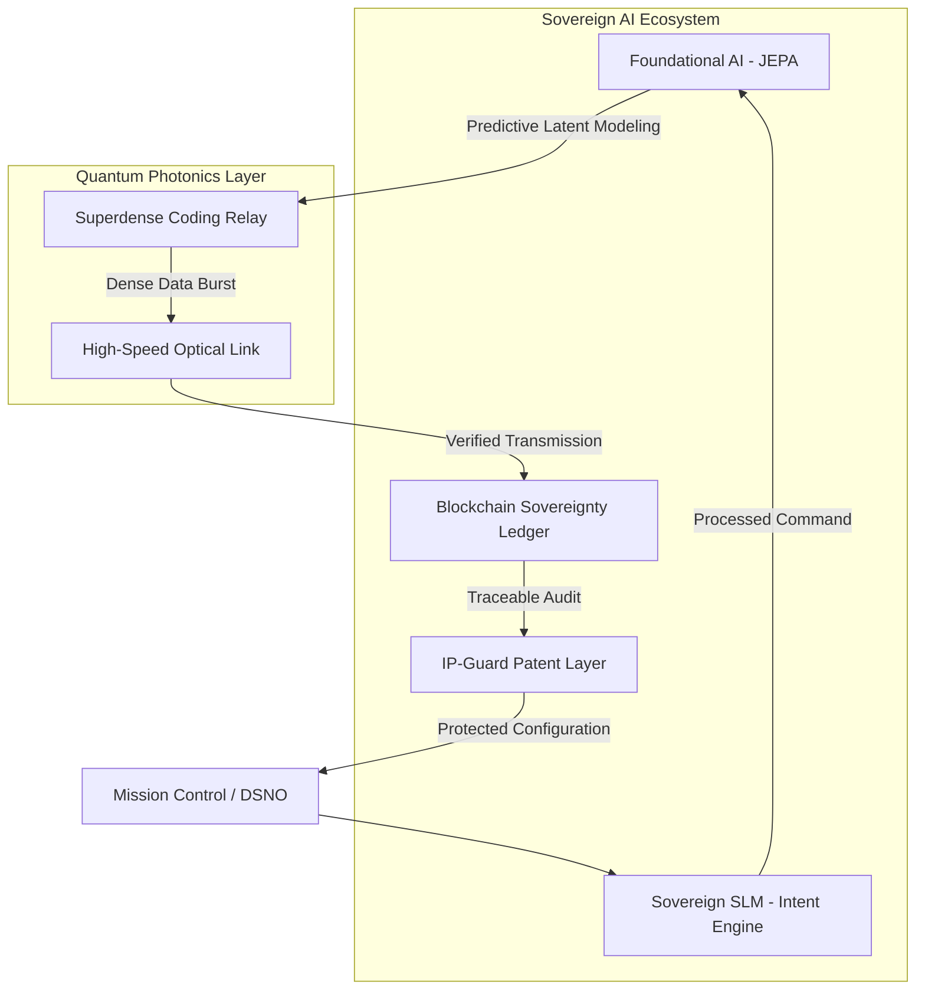

# 🏗️ Space-Link EcoSystem: Architectural Blueprint

## 📜 Vision: Integrated Automated System of Systems
Space-Link is designed as a foundational node within a larger, sovereign AI-Quantum EcoSystem. It bridges deep-space communications with terrestrial intelligence using a multi-layered approach.

---

## 🛰️ Layer 1: Physical & Quantum (Photonics-Based)
- **Quantum Superdense Coding (QSDC)**: Achieves 2:1 bit-to-qubit efficiency. Implemented via photon-state manipulation as described in in-house foundational research.
- **Photonics Interconnect**: High-speed optical data relay between Earth (DSNO) and Moon Station.

## 🧠 Layer 2: Intelligence (Foundational AI - JEPA)
- **Space-JEPA Engine**: Utilizes **Joint-Embedding Predictive Architecture** to model the latent variables of the space environment.
- **Proactive Mitigation**: Predicts Solar Flares and Orbital Drift before they impact the signal, allowing for real-time protocol switching to minimize data loss.
- **Self-Healing Loop**: Autonomous recalibration of laser targeting based on JEPA predictions.
- **Sovereign SLM**: Small Language Model for secure, low-latency command intent detection in deep-space environments.

## 🔗 Layer 3: Sovereignty & Traceability (Blockchain)
- **Sovereignty Ledger**: Every packet transmission is hashed and signed into an immutable decentralized ledger.
- **Traceable Integrity**: Ensures "Digital Sovereignty" by providing a verifiable audit trail of all command uplinks and telemetry downlinks.
- **TAMPER-PROOF**: Protects against "Spoofing Hacks" by cross-referencing packet hashes with the ledger.

---

## 🛠️ System Flow
1. **Perception**: Space-Link sensors gather photon-level telemetry.
2. **Prediction (JEPA)**: The AI layer projects the environment state into a latent space to predict interference.
3. **Transmission**: Data is encoded via QSDC and sent through the photonics relay.
4. **Validation (Blockchain)**: The packet is logged into the Sovereignty Ledger for permanent traceability.
5. **Observation**: Resulting QBER (Quantum Bit Error Rate) is fed back into the JEPA engine to further train the foundational model.

---

## 🎯 Strategic Alignment with KIREAP
This architecture directly implements the core components of the KIREAP vision:
- **Foundational Models (JEPA)** for intelligent prediction.
- **Blockchain** for digital sovereignty and traceability.
- **Quantum Capabilities** (Photonics-based) for high-efficiency communication.
- **System of Systems** design for an integrated, automated ecosystem.

---
**Developed by Dr. Usha & Team | Space-Link Project | Sr. AI Solution Architect Vision**
