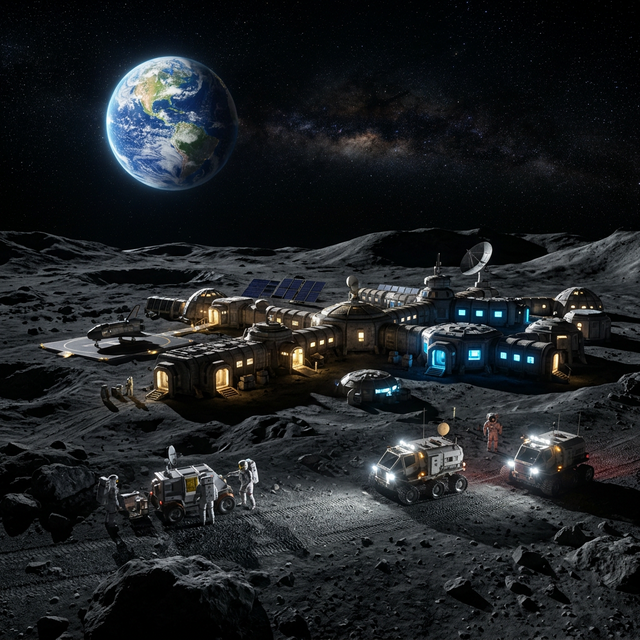

# 🌌 Space-Link: Quantum-SDC Deep Space Data Relay

**High-Efficiency Photon-Based Data Transmission with Quantum Superdense Coding (QSDC).**



## 🚀 Overview
Space-Link is an advanced simulation of a deep-space communication relay between **Earth (DSNO)** and the **Moon Station**. It utilizes **Quantum Superdense Coding** to achieve high-efficiency data throughput (800% net gain over traditional RF) while maintaining cryptographic integrity through photon-level monitoring.

The project features a **Premium HUD Mission Control** dashboard designed for real-time monitoring of planetary data links.

## ✨ Key Features
- **Quantum Superdense Coding (QSDC)**: Simulates the transmission of 2 classical bits using only 1 entangled qubit.
- **Advanced AIGC-HUD**: A professional, glassmorphism-based dashboard with real-time Three.js orbital visualizations.
- **Multimedia Payloads**: Supports transmission and decryption of **Images, Video, Audio, and Telemetry**.
- **User Command Uplink**: Interactive UI section allowing operators to send direct commands to the Lunar station.
- **Anomaly Detection & Security**: Real-time simulation of space weather (Solar Flares), orbital debris, and **SPOOFING HACKS** with manual resolution overrides.

## 🛠️ Project Structure
- `launcher.py`: The main entry point. Starts the Mission Control server and browser.
- `continuous_simulation.py`: The physics/quantum engine that generates live mission data.
- `database_manager.py`: Handles secure sync with the Supabase Cloud database.
- `dashboard/`: The web-based Mission Control interface (HTML5/CSS3/Vanilla JS).
- `quantum_relay.py`: Core logic for Superdense Coding and QBER (Quantum Bit Error Rate) calculation.

## 🚦 Getting Started

### 1. Prerequisites
- Python 3.8+
- Supabase Project (for cloud sync)

### 2. Installation
```powershell
# Clone the repository
git clone https://github.com/VinodKumarGanta/test1.git
cd test1
```

### 3. Running the Mission
1. Start the simulation engine:
   ```powershell
   python continuous_simulation.py
   ```
2. Launch the Mission Control Dashboard:
   ```powershell
   python launcher.py
   ```

## 🛰️ Judges' Presentation Guide
To demonstrate the system's advanced capabilities:
1. **Interactive Uplink**: Type a message in the "USER COMMAND UPLINK" and watch it get decoded by the Moon station.
2. **Force Jamming**: Click the "FORCE JAMMING TEST" to show how the system detects and blocks unauthorized interference.
3. **Multimedia Verification**: Use "REFRESH DATA" to see decrypted images of the lunar surface transmitted via the quantum link.

---
**Developed for High-Efficiency Space Communication | Hackathon Edition**
